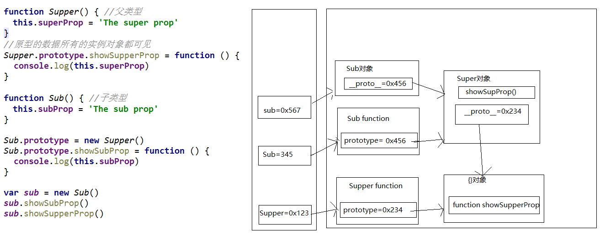

# html+css

### 1. 左边固定，右边自适应

方法一：

~~~html
<style>
    .one {
        position: absolute;
        height: 100px;
        width: 300px;
        background-color: blue;
    }
    .two {
        height: 200px;
        margin-left: 300px;
        background-color: red;
    }
</style>
<body>
    <div class="one"></div>
    <div class="two">第一种方法</div>
</body>
~~~

方法二：

~~~html
<style>
    .one {
        float: left;
        height: 100px;
        width: 300px;
        background-color: blue;
    }
    .two {
        overflow: auto;
        height: 200px;
        background-color: red;
    }
</style>
<body>
    <div class="one"></div>
    <div class="two">第二种方法</div>
</body>
~~~

### 2. 超出部分不换行，省略号显示

~~~html
<style>
    .over {
        width: 200px; 
        white-space: nowrap; /*强制不换行*/
        overflow: hidden; /*清除浮动，多余部分不显示*/
        text-overflow: ellipsis; /*省略号*/
    }
</style>
<body>
    <div class="over">超出部分不换行测试，以省略号显示。</div>
</body>
~~~

### 3. css hask兼容

css hask大全 

| 标记                                                         | IE6     | IE7     | IE8     | FF             | Opera  | Sarari |
| :----------------------------------------------------------- | ------- | ------- | ------- | -------------- | ------ | ------ |
| [*+><]                                                       | √       | √       | X       | X              | X      | X      |
| _                                                            | √       | X       | X       | X              | X      | X      |
| \9                                                           | √       | √       | √       | X              | X      | X      |
| \0                                                           | X       | X       | √       | X              | √      | X      |
| @media screen and (-webkit-min-device-pixel-ratio:0){.bb {}} | X       | X       | X       | X              | X      | √      |
| .bb , x:-moz-any-link, x:default                             | X       | √       | X       | √(ff3.5及以下) | X      | X      |
| @-moz-document url-prefix(){.bb{}}                           | X       | X       | X       | √              | X      | X      |
| @media all and (min-width: 0px){.bb {}}                      | X       | X       | X       | √              | √      | √      |
| * +html .bb {}                                               | X       | √       | X       | X              | X      | X      |
| 浏览器内核                                                   | Trident | Trident | Trident | Gecko          | Presto | WebKit |

（以上 .bb 可更换为其它样式名）

~~~css
.bb {
    height: 32px;
    background-color: #f1ee18; /*所有识别*/
    background-color: red\9; /*IE6、7、8识别*/
    *background-color: #a200ff; /*IE6、7识别*/
    _background-color: #1e0bd1; /*IE6识别*/
}
~~~

**1、属性级Hack：比如IE6能识别下划线"\_"和星号“\*”，IE7能识别星号“*”，但不能识别下划线”_ ”，而firefox两个都不能认识。**

**2、选择符级Hack：比如IE6能识别\*html .class{}，IE7能识别\*+html .class{}或者\*:first-child+html .class{}。**

**3、IE条件注释Hack：IE条件注释是微软IE5开始就提供的一种非标准逻辑语句。**

**比如针对所有IE：**

**&lt;!-[if IE]&gt;&lt;!-您的代码-&gt;&lt;![endif]&gt;，针对IE6及以下版本：**

**&lt;!-[if it IE 7]&gt;&lt;!-您的代码-&gt;&lt;![endif]-&gt;，这类Hack不仅对CSS生效，对写在判断语句里面的所有代码都会生效。**

~~~css
<!--[if IE 7]>
    <style>
    .ie7{display:inline;}
    </style>
<![endif]-->
~~~

[css hask大全](https://www.duitang.com/static/csshack.html )        [CSS 条件 Hack](http://www.w3chtml.com/css3/hack/conditions.html )

### 4. 使用内核前缀兼容

- 1、-moz代表firefox浏览器私有属性

- 2、-ms代表ie浏览器私有属性

- 3、-webkit代表safari、chrome私有属性

- 4、新浏览器直接写

  ~~~css
  .box {
      -moz-border-radius: 1em; /* Firefox */
      -webkit-border-radius: 1em; /* Safari Chrome*/
      border-radius: 1em;
  }
  ~~~

### 5.  自定义检测低版本ie的函数

~~~javascript
<script type="text/javascript">
console.log(isIE(8));

//js中的作用域都是函数作用域
function isIE(version){
    var b = document.createElement("b");
    b.innerHTML="<!--[if IE "+version+"]><i></i><![endif]-->";
    return b.getElementsByTagName("i").length == 1 ;
}
</script>
~~~


### 6. 盒模型

- **标准盒模型**

  在标准模式下的盒模型如下图所示，盒子总宽度/高度=width/height+padding+border+margin；

  

- **怪异盒模型**

  在怪异模式下的盒模型如下图所示，**盒子的总宽度和高度是包含内边距padding和边框border宽度在内的，**

  盒子总宽度/高度=width/height + margin = 内容区的宽度/高度 + padding + border + margin;

  

box-sizing有两个值一个是content-box，另一个是border-box。

**当设置为box-sizing:content-box时，将采用标准模式解析计算，也是默认模式；**

**当设置为box-sizing:border-box时，将采用怪异模式解析计算；**

```css
box-sizing:border-box; /* 其他 */
-moz-box-sizing:border-box; /* Firefox */
-webkit-box-sizing:border-box; /* Safari Chrome*/
```

ie8以上都是w3c标准盒模型    ie5极其以下都是ie盒子模型，ie6、ie7、ie8在混杂模式下ie盒模型，在标准模式下是w3c标准盒模型

(注意：ie6在混杂模式下一定是Ie盒模型，而ie7、ie8在混杂模式下不一定是ie盒模型)

[标准盒模型和ie盒模型(怪异盒模型)](https://www.cnblogs.com/Walker-lyl/p/7454213.html )

### 7. IE BUG

- IE6下，float时，margin产生双倍间距。

   解决方法，使用display:inline;

- IE7，IE8样式不兼容

  解决方案，加入HTTP meta-tag，<meta http-equiv="X-UA-Compatible" content="IE=EmulateIE7" />

### 8. CSS 动画  Transitions、Animations以及Transform

- **Transitions**（过渡动画）：平滑的改变CSS的值

  ~~~css
  div {
      width: 100px;
      height: 100px;
      background: #ffff00;
      transition: width 1s linear 2s,background-color 1s linear 2s;
  }
  div:hover{
      width: 200px;
      background-color: #003366;
  }
  ~~~

- **Transform**：基本的改变，主要实现拉伸，压缩，旋转，偏移等

  ~~~css
  transform: rotate( 30deg );
  ~~~

- **Animations**（动画）：适用于CSS2、CSS3动画

  首先我们需要创建关键帧的集合 @keyframes 关键帧集合名

  ~~~css
  div {
      width: 100px;
      height: 300px;
      color: white;
      background-color: black;
  }
  @keyframes mycolor {
      0% {
          background-color: red;
          transform: rotate( 0deg );
      }
      40% {
          background-color: yellow;
          transform: rotate( 30deg );
      }
      70% {
          background-color: blue;
          transform: rotate( -30deg );
      }
      100% {
          background-color: green;
          transform: rotate( 0deg );
      }
  }
  div:hover {
      animation:mycolor 5s linear 2s;
  }
  ~~~

  [CSS3中动画效果Transitions与Animations的区别](https://www.cnblogs.com/guoqing26/p/5244620.html)

### 9. cache机制

[彻底理解浏览器缓存机制](https://www.cnblogs.com/shixiaomiao1122/p/7591556.html)

# javascript高级

## 一、基础总结

### 1. 数据类型

**字符串、数字、布尔、数组、对象、Null、Undefined**

- 基本(值)类型
  - Number ----- 任意数值 -------- typeof
  - String ----- 任意字符串 ------ typeof
  - Boolean ---- true/false ----- typeof
  - undefined --- undefined ----- typeof/===
  - null -------- null ---------- ===
- 对象(引用)类型
  - Object ----- typeof/instanceof
  - Array ------ instanceof
  - Function ---- typeof

typeof 能判断number 、string 、boolean 、undefined 、object 、function 。

**注意：typeof null == object、typeof [1,3,2] == object**

**===与==**

当进行双等号比较时候： 先检查两个操作数数据类型，如果相同， 则进行===比较， 如果不同， 则愿意为你进行一次类型转换， 转换成相同类型后再进行比较， 而===比较时， 如果类型不同，直接就是false.

```js
5 + null // 5
5 + undefined // NaN
//1. 基本
// typeof返回数据类型的字符串表达
var a
console.log(a, typeof a, typeof a==='undefined',a===undefined )  // undefined 'undefined' true true
console.log(undefined==='undefined') // false
a = 4
console.log(typeof a==='number')
a = 'atguigu'
console.log(typeof a==='string')
a = true
console.log(typeof a==='boolean')
a = null
console.log(typeof a, a===null) // 'object'
//2. 对象
var b1 = {
    b2: [1, 'abc', console.log],
    b3: function () {
        console.log('b3')
        return function () {
            return 'xfzhang'
        }
    }
}
console.log(b1 instanceof Object, b1 instanceof Array) // true  false
console.log(b1.b2 instanceof Array, b1.b2 instanceof Object) // true true
console.log(b1.b3 instanceof Function, b1.b3 instanceof Object) // true true
console.log(typeof b1.b2) // 'object'
console.log(typeof b1.b3==='function') // true
console.log(typeof b1.b2[2]==='function')
b1.b2[2](4)
console.log(b1.b3()())
```

[JS中的六大数据类型](https://www.cnblogs.com/xuniannian/p/7452086.html)

undefined与null的区别?

  \* undefined代表定义未赋值

  \* nulll定义并赋值了, 只是值为null

什么时候给变量赋值为null呢?

 \* 初始赋值, 表明将要赋值为对象

  \* 结束前, 让对象成为垃圾对象(被垃圾回收器回收) 

严格区别变量类型与数据类型?

  \* 数据的类型

​    \* 基本类型

​    \* 对象类型

  \* 变量的类型(变量内存值的类型)

​    \* 基本类型: 保存就是基本类型的数据

​    \* 引用类型: 保存的是地址值

### 2. 关于引用变量赋值问题

- 2个引用变量指向同一个对象, 通过一个变量修改对象内部数据, 另一个变量看到的是修改之后的数据

- 2个引用变量指向同一个对象, 让其中一个引用变量指向另一个对象, 另一引用变量依然指向前一个对象

~~~js
var obj1 = {name: 'Tom'}
var obj2 = obj1
obj2.age = 12
console.log(obj1.age)  // 12
function fn (obj) {
    obj.name = 'A'
}
fn(obj1)
console.log(obj2.name) //A

var a = {age: 12}
var b = a
a = {name: 'BOB', age: 13}
b.age = 14
console.log(b.age, a.name, a.age) // 14 Bob 13

function fn2 (obj) {
    obj = {age: 15}
}
fn2(a)
console.log(a.age) //13
~~~

### 3. 问题: 在js调用函数时传递变量参数时, 是值传递还是引用传递

  **内存分类**

- 栈: 全局变量/局部变量

- 堆: 对象

  \* 理解1: 都是值(基本/地址值)传递

  \* 理解2: 可能是值传递, 也可能是引用传递(地址值)

基本类型（值类型）在调用函数的时候，传递的是值

引用类型，在函数调用的时候，传递的是地址（引用）

~~~js
var a = 3
function fn (a) {
    a = a + 1
}
fn(a)
console.log(a)   //3

function fn2 (obj) {
    console.log(obj.name)
}
var obj = {name: 'Tom'}
fn2(obj)   //Tom
~~~

**值类型的值在栈空间存储，引用类型的对象在堆中存储，地址在栈中存储**

[深入理解JavaScript中的堆与栈 、浅拷贝与深拷贝](https://blog.csdn.net/flyingpig2016/article/details/52895620)

### 4. 问题: JS引擎如何管理内存?

1. 内存生命周期

     \* 分配小内存空间, 得到它的使用权

     \* 存储数据, 可以反复进行操作

     \* 释放小内存空间

2. 释放内存

     \* 局部变量: 函数执行完自动释放

     \* 对象: 成为垃圾对象==>垃圾回收器回收

~~~js
var a = 3
var obj = {}
//占用3个空间，a：3、obj在栈空间，{}在堆空间
obj = null
//现在是两个空间，a:3、obj:null

function fn () {
    var b = {}
}
fn() // b是自动释放, b所指向的对象是在后面的某个时刻由垃圾回收器回收
~~~

### 5. 问题: 什么时候必须使用['属性名']的方式访问对象?

- 属性名包含特殊字符: - 空格

- 属性名不确定

  ~~~javascript
  var p = {}
  //1. 给p对象添加一个属性: content type: text/json
  // p.content-type = 'text/json' //不能用
  p['content-type'] = 'text/json'
  console.log(p['content-type'])
  
  //2. 属性名不确定
  var propName = 'myAge'
  var value = 18
  // p.propName = value //不能用
  p[propName] = value
  console.log(p[propName])
  ~~~

### 6. 函数

~~~javascript
1. 什么是函数?
    * 实现特定功能的n条语句的封装体
    * 只有函数是可以执行的, 其它类型的数据不能执行
2. 为什么要用函数?
    * 提高代码复用
    * 便于阅读交流
3. 如何定义函数?
    * 函数声明
    * 表达式
function fn1 () { //函数声明
console.log('fn1()')
}
var fn2 = function () { //表达式
console.log('fn2()')
}
4. 如何调用(执行)函数?
    * test(): 直接调用
    * obj.test(): 通过对象调用
    * new test(): new调用
    * test.call/apply(obj): 临时让test成为obj的方法进行调用
var obj = {}
function test2 () {
    this.xxx = 'atguigu'
}
// obj.test2()  不能直接, 根本就没有
test2.call(obj) // obj.test2()   // 可以让一个函数成为指定任意对象的方法进行调用
console.log(obj.xxx)
~~~

### 7. 回调函数

1. 什么函数才是回调函数?

     \* 你定义的

     \* 你没有调

     \* 但最终它执行了(在某个时刻或某个条件下)

2. 常见的回调函数?

     \* dom事件回调函数 ==>发生事件的dom元素

     \* 定时器回调函数 ===>window

     \* ajax请求回调函数

     \* 生命周期回调函数

~~~javascript
document.getElementById('btn').onclick = function () { // dom事件回调函数
    alert(this.innerHTML)
}
//定时器
setTimeout(function () { // 定时器回调函数
    alert('到点了'+this)
}, 2000)
~~~

### 8. 立即调用IIFE

全称：Immediately-Invoked Function Expression

 作用

  \* 隐藏实现

  \* 不会污染外部(全局)命名空间

  \* 用它来编码js模块

~~~js
(function () { //匿名函数自调用
    var a = 3
    console.log(a + 3)
})()
var a = 4
console.log(a);

(function () {
    var a = 1
    function test () {
        console.log(++a)
    }
    window.$ = function () { // 向外暴露一个全局函数
        return {
            test: test
        }
    }
})()

$().test() // 1. $是一个函数 2. $执行后返回的是一个对象
~~~

### 9. this

1. this是什么?

     \* 任何函数本质上都是通过某个对象来调用的,如果没有直接指定就是window

     \* 所有函数内部都有一个变量this

     \* 它的值是调用函数的当前对象

2. 如何确定this的值?

     \* test(): window

     \* p.test(): p

     \* new test(): 新创建的对象

     \* p.call(obj): obj

~~~javascript
function Person(color) {
    console.log(this)
    this.color = color;
    this.getColor = function () {
        console.log(this)
        return this.color;
    };
    this.setColor = function (color) {
        console.log(this)
        this.color = color;
    };
}

Person("red"); //this是谁? window

var p = new Person("yello"); //this是谁? p

p.getColor(); //this是谁? p

var obj = {};
p.setColor.call(obj, "black"); //this是谁? obj

var test = p.setColor;
test(); //this是谁? window

function fun1() {
    function fun2() {
        console.log(this);
    }

    fun2(); //this是谁? window
}
fun1();
~~~

## 二、函数高级

### 1. 原型

- 函数的prototype属性(图)

    \* 每个函数都有一个prototype属性, 它默认指向一个Object空对象(即称为: 原型对象)

    \* 原型对象中有一个属性constructor, 它指向函数对象


- 给原型对象添加属性(一般都是方法)

    \* 作用: 函数的所有实例对象自动拥有原型中的属性(方法)

~~~javascript
// 每个函数都有一个prototype属性, 它默认指向一个Object空对象(即称为: 原型对象)
console.log(Date.prototype, typeof Date.prototype)
function Fun () {

}
console.log(Fun.prototype)  // 默认指向一个Object空对象(没有我们的属性)

// 原型对象中有一个属性constructor, 它指向函数对象
console.log(Date.prototype.constructor===Date)
console.log(Fun.prototype.constructor===Fun)

//给原型对象添加属性(一般是方法) ===>实例对象可以访问
Fun.prototype.test = function () {
    console.log('test()')
}
var fun = new Fun()
fun.test()
~~~

### 2. 显式原型与隐式原型

- 每个函数function都有一个prototype，即显式原型(属性)

- 每个实例对象都有一个__proto__，可称为隐式原型(属性)

- 对象的隐式原型的值为其对应构造函数的显式原型的值

- 内存结构(图)

  

- 总结:

    \* 函数的prototype属性: 在定义函数时自动添加的, 默认值是一个空Object对象

    \* 对象的\__proto__属性: 创建对象时自动添加的, 默认值为构造函数的prototype属性值

    \* 程序员能直接操作显式原型, 但不能直接操作隐式原型(ES6之前)

~~~js
//定义构造函数
function Fn() {   // 内部语句: this.prototype = {}

}
// 1. 每个函数function都有一个prototype，即显式原型属性, 默认指向一个空的Object实例对象
console.log(Fn.prototype)
// 2. 每个实例对象都有一个__proto__，可称为隐式原型
//创建实例对象
var fn = new Fn()  // 内部语句: this.__proto__ = Fn.prototype
console.log(fn.__proto__)
// 3. 对象的隐式原型的值为其对应构造函数的显式原型的值
console.log(Fn.prototype===fn.__proto__) // true
//给原型添加方法
Fn.prototype.test = function () {
    console.log('test()')
}
//通过实例调用原型的方法
fn.test()
~~~

### 3. 原型链

- 原型链(图解)

  \* 访问一个对象的属性时，

  ​    \* 先在自身属性中查找，找到返回

  ​    \* 如果没有, 再沿着\__proto__这条链向上查找, 找到返回

  ​    \* 如果最终没找到, 返回undefined

  \* 别名: 隐式原型链

  \* 作用: 查找对象的属性(方法)

  

- 构造函数/原型/实体对象的关系(图解)


- 构造函数/原型/实体对象的关系2(图解)


~~~js
function Fn() {
    this.test1 = function () {
        console.log('test1()')
    }
}
console.log(Fn.prototype)
Fn.prototype.test2 = function () {
    console.log('test2()')
}

var fn = new Fn()

fn.test1()
fn.test2()
console.log(fn.toString())
console.log(fn.test3)
// fn.test3()

/*
  1. 函数的显示原型指向的对象默认是空Object实例对象(但Object不满足)
 */
console.log(Fn.prototype instanceof Object) // true
console.log(Object.prototype instanceof Object) // false
console.log(Function.prototype instanceof Object) // true
/*
  2. 所有函数都是Function的实例(包含Function)
  */
console.log(Function.__proto__===Function.prototype)
/*
  3. Object的原型对象是原型链尽头
   */
console.log(Object.prototype.__proto__) // null

~~~

### 4. 原型链_属性问题

- 读取对象的属性值时: 会自动到原型链中查找

- 设置对象的属性值时: 不会查找原型链, 如果当前对象中没有此属性, 直接添加此属性并设置其值

- 方法一般定义在原型中, 属性一般通过构造函数定义在对象本身上

~~~javascript
function Fn() {

}
Fn.prototype.a = 'xxx'
var fn1 = new Fn()
console.log(fn1.a, fn1)

var fn2 = new Fn()
fn2.a = 'yyy'
console.log(fn1.a, fn2.a, fn2)

function Person(name, age) {
    this.name = name
    this.age = age
}
Person.prototype.setName = function (name) {
    this.name = name
}
var p1 = new Person('Tom', 12)
p1.setName('Bob')
console.log(p1)

var p2 = new Person('Jack', 12)
p2.setName('Cat')
console.log(p2)
console.log(p1.__proto__===p2.__proto__) // true
~~~

### 5. 探索instanceof

- instanceof是如何判断的?

    \* 表达式: A instanceof B

    \* 如果B函数的显式原型对象在A对象的原型链上, 返回true, 否则返回false

- Function是通过new自己产生的实例

~~~js
/*
  案例1
   */
function Foo() {  }
var f1 = new Foo()
console.log(f1 instanceof Foo) // true
console.log(f1 instanceof Object) // true

/*
  案例2
   */
console.log(Object instanceof Function) // true
console.log(Object instanceof Object) // true
console.log(Function instanceof Function) // true
console.log(Function instanceof Object) // true

function Foo() {}
console.log(Object instanceof  Foo) // false
~~~

### 6. 原型相关面试题

~~~js
/*
  测试题1
   */
function A () {

}
A.prototype.n = 1

var b = new A()

A.prototype = {
    n: 2,
    m: 3
}

var c = new A()
console.log(b.n, b.m, c.n, c.m)


/*
   测试题2
   */
function F (){}
Object.prototype.a = function(){
    console.log('a()')
}
Function.prototype.b = function(){
    console.log('b()')
}

var f = new F()
f.a()
// f.b()
F.a()
F.b()
console.log(f)
console.log(Object.prototype)
console.log(Function.prototype)
~~~

### 7. 变量提升与函数提升

- 变量声明提升

    \* 通过var定义(声明)的变量, 在定义语句之前就可以访问到

    \* 值: undefined

- 函数声明提升

    \* 通过function声明的函数, 在之前就可以直接调用

    \* 值: 函数定义(对象)

- 问题: 变量提升和函数提升是如何产生的?

~~~javascript
var a = 3
function fn () {
    console.log(a)
    var a = 4
}
fn() // 输出 undefined

console.log(b) //undefined  变量提升
fn2() //可调用  函数提升
// fn3() //不能  变量提升

var b = 3
function fn2() {
    console.log('fn2()')
}

var fn3 = function () {
    console.log('fn3()')
}
~~~

### 8. 执行上下文

- 代码分类(位置)

    \* 全局代码

    \* 函数(局部)代码

- 全局执行上下文

    \* 在执行全局代码前将window确定为全局执行上下文

    \* 对全局数据进行预处理

  ​      \* var定义的全局变量==>undefined, 添加为window的属性

  ​      \* function声明的全局函数==>赋值(fun), 添加为window的方法

  ​      \* this==>赋值(window)

    \* 开始执行全局代码

- 函数执行上下文

    \* 在调用函数, 准备执行函数体之前, 创建对应的函数执行上下文对象(虚拟的, 存在于栈中)

    \* 对局部数据进行预处理

  ​      \* 形参变量==>赋值(实参)==>添加为执行上下文的属性

  ​      \* arguments==>赋值(实参列表), 添加为执行上下文的属性

  ​      \* var定义的局部变量==>undefined, 添加为执行上下文的属性

  ​      \* function声明的函数 ==>赋值(fun), 添加为执行上下文的方法

  ​      \* this==>赋值(调用函数的对象)

    \* 开始执行函数体代码

~~~javascript
console.log(a1, window.a1)
window.a2()
console.log(this)

var a1 = 3
function a2() {
    console.log('a2()')
}
console.log(a1)
~~~

### 9. 提升相关面试题

~~~js
/*
   测试题1:  先执行变量提升, 再执行函数提升
   */
function a() {}
var a
console.log(typeof a) // 'function'


/*
   测试题2:
   */
if (!(b in window)) {
    var b = 1
}
console.log(b) // undefined

/*
   测试题3:
   */
var c = 1
function c(c) {
    console.log(c)
    var c = 3
}
c(2) // 报错
~~~

### 10. 作用域

- 理解

    \* 就是一块"地盘", 一个代码段所在的区域

    \* 它是静态的(相对于上下文对象), 在编写代码时就确定了

- 分类

    \* 全局作用域

    \* 函数作用域

    \* 没有块作用域(ES6有了)

- 作用

    \* 隔离变量，不同作用域下同名变量不会有冲突

~~~javascript
/*  //没块作用域
if(true) {
var c = 3
}
console.log(c)*/

var a = 10,
    b = 20
function fn(x) {
    var a = 100,
        c = 300;
    console.log('fn()', a, b, c, x)
    function bar(x) {
        var a = 1000,
            d = 400
        console.log('bar()', a, b, c, d, x)
    }

    bar(100)
    bar(200)
}
fn(10)
~~~

### 11. 作用域与执行上下文

- 区别1

    \* 全局作用域之外，每个函数都会创建自己的作用域，作用域在函数定义时就已经确定了。而不是在函数调用时

    \* 全局执行上下文环境是在全局作用域确定之后, js代码马上执行之前创建

    \* 函数执行上下文是在调用函数时, 函数体代码执行之前创建

- 区别2

    \* 作用域是静态的, 只要函数定义好了就一直存在, 且不会再变化

    \* 执行上下文是动态的, 调用函数时创建, 函数调用结束时就会自动释放

- 联系

    \* 执行上下文(对象)是从属于所在的作用域

    \* 全局上下文环境==>全局作用域

    \* 函数上下文环境==>对应的函数使用域

~~~javascript
var a = 10,
    b = 20
function fn(x) {
    var a = 100,
        c = 300;
    console.log('fn()', a, b, c, x)
    function bar(x) {
        var a = 1000,
            d = 400
        console.log('bar()', a, b, c, d, x)
    }

    bar(100)
    bar(200)
}
fn(10)
~~~

### 12. 作用域链

- 理解

    \* 多个上下级关系的作用域形成的链, 它的方向是从下向上的(从内到外)

    \* 查找变量时就是沿着作用域链来查找的

- 查找一个变量的查找规则

    \* 在当前作用域下的执行上下文中查找对应的属性, 如果有直接返回, 否则进入2

    \* 在上一级作用域的执行上下文中查找对应的属性, 如果有直接返回, 否则进入3

    \* 再次执行2的相同操作, 直到全局作用域, 如果还找不到就抛出找不到的异常

~~~javascript
var a = 1
function fn1() {
    var b = 2
    function fn2() {
        var c = 3
        console.log(c)
        console.log(b)
        console.log(a)
        console.log(d)
    }
    fn2()
}
fn1()
~~~

### 13. 作用域_面试题

~~~javascript
//面试题1
var x = 10;
function fn() {
    console.log(x);
}
function show(f) {
    var x = 20;
    f();
}
show(fn);

//面试题2
var fn = function () {
    console.log(fn)
}
fn()

var obj = {
    fn2: function () {
        console.log(fn2)
        //console.log(this.fn2)
    }
}
obj.fn2()
~~~

### 14. 闭包

- 如何产生闭包?

    \* 当一个嵌套的内部(子)函数引用了嵌套的外部(父)函数的变量(函数)时, 就产生了闭包

- 闭包到底是什么?

    \* 使用chrome调试查看

    \* 理解一: 闭包是嵌套的内部函数(绝大部分人)

    \* 理解二: 包含被引用变量(函数)的对象(极少数人)

    \* 注意: 闭包存在于嵌套的内部函数中

- 产生闭包的条件?

    \* 函数嵌套

    \* 内部函数引用了外部函数的数据(变量/函数)

~~~javascript
function fn1 () {
    var a = 2
    var b = 'abc'
    function fn2 () { //执行函数定义就会产生闭包(不用调用内部函数)
        console.log(a)
    }
    // fn2()
}
fn1()

function fun1() {
    var a = 3
    var fun2 = function () {
        console.log(a)
    }
    }
fun1()
~~~

- 常见的闭包

  - 将函数作为另一个函数的返回值

  - 将函数作为实参传递给另一个函数调用

~~~javascript
// 1. 将函数作为另一个函数的返回值
function fn1() {
    var a = 2
    function fn2() {
        a++
        console.log(a)
    }
    return fn2
}
var f = fn1()
f() // 3
f() // 4

// 2. 将函数作为实参传递给另一个函数调用
function showDelay(msg, time) {
    setTimeout(function () {
        alert(msg)
    }, time)
}
showDelay('atguigu', 2000)
~~~

- 闭包的作用

  - 使用函数内部的变量在函数执行完后, 仍然存活在内存中(延长了局部变量的生命周期)

  - 让函数外部可以操作(读写)到函数内部的数据(变量/函数)

  问题:

  \* 函数执行完后, 函数内部声明的局部变量是否还存在?  一般是不存在, 存在于闭中的变量才可能存在

  \* 在函数外部能直接访问函数内部的局部变量吗? 不能, 但我们可以通过闭包让外部操作它

  ~~~javascript
  function fn1() {
      var a = 2
      function fn2() {
          a++
          console.log(a)
          // return a
      }
      function fn3() {
          a--
          console.log(a)
      }
      return fn3
  }
  var f = fn1()
  f() // 1
  f() // 0
  ~~~


- 闭包的生命周期

  - 产生: 在嵌套内部函数定义执行完时就产生了(不是在调用)

  - 死亡: 在嵌套的内部函数成为垃圾对象时

  ~~~javascript
  function fn1() {
      //此时闭包就已经产生了(函数提升, 内部函数对象已经创建了)
      var a = 2
      function fn2 () {
          a++
          console.log(a)
      }
      return fn2
  }
  var f = fn1()
  f() // 3
  f() // 4
  f = null //闭包死亡(包含闭包的函数对象成为垃圾对象)
  ~~~

- 闭包的应用_自定义JS模块

    \* 具有特定功能的js文件

    \* 将所有的数据和功能都封装在一个函数内部(私有的)

    \* 只向外暴露一个包信n个方法的对象或函数

    \* 模块的使用者, 只需要通过模块暴露的对象调用方法来实现对应的功能

  ~~~javascript
  <script type="text/javascript">
  function myModule() {
      //私有数据
      var msg = 'My atguigu'
      //操作数据的函数
      function doSomething() {
          console.log('doSomething() '+msg.toUpperCase())
      }
      function doOtherthing () {
          console.log('doOtherthing() '+msg.toLowerCase())
      }
  
      //向外暴露对象(给外部使用的方法)
      return {
          doSomething: doSomething,
          doOtherthing: doOtherthing
      }
  }
  </script>
  
  <script type="text/javascript">
      var module = myModule()
      module.doSomething()
      module.doOtherthing()
  </script>
  ~~~

  ~~~javascript
  <script type="text/javascript">
  (function () {
    //私有数据
    var msg = 'My atguigu'
    //操作数据的函数
    function doSomething() {
      console.log('doSomething() '+msg.toUpperCase())
    }
    function doOtherthing () {
      console.log('doOtherthing() '+msg.toLowerCase())
    }
  
    //向外暴露对象(给外部使用的方法)
    window.myModule2 = {
      doSomething: doSomething,
      doOtherthing: doOtherthing
    }
  })()
  </script>
  
  <script type="text/javascript">
    myModule2.doSomething()
    myModule2.doOtherthing()
  </script>
  ~~~

- 闭包的缺点及解决

  - 缺点

      \* 函数执行完后, 函数内的局部变量没有释放, 占用内存时间会变长

      \* 容易造成内存泄露

  - 解决

      \* 能不用闭包就不用

      \* 及时释放

  ~~~javascript
  function fn1() {
      var arr = new Array[100000]
      function fn2() {
          console.log(arr.length)
      }
      return fn2
  }
  var f = fn1()
  f()
  
  f = null //让内部函数成为垃圾对象-->回收闭包
  ~~~

- 面试题1

  ~~~javascript
  //代码片段一
  var name = "The Window";
  var object = {
      name : "My Object",
      getNameFunc : function(){
          return function(){
              return this.name;
          };
      }
  };
  alert(object.getNameFunc()());  //?  the window
  
  
  //代码片段二
  var name2 = "The Window";
  var object2 = {
      name2 : "My Object",
      getNameFunc : function(){
          var that = this;
          return function(){
              return that.name2;
          };
      }
  };
  alert(object2.getNameFunc()()); //?  my object
  ~~~

- 面试题2

  ~~~javascript
  function fun(n,o) {
      console.log(o)
      return {
          fun:function(m){
              return fun(m,n)
          }
      }
  }
  var a = fun(0)
  a.fun(1)
  a.fun(2)
  a.fun(3)//undefined,0,0,0
  
  var b = fun(0).fun(1).fun(2).fun(3)//undefined,0,1,2
  
  var c = fun(0).fun(1)
  c.fun(2)
  c.fun(3)//undefined,0,1,1
  ~~~

## 三、对象高级

### 1. 对象创建模式

方式一: Object构造函数模式

  \* 套路: 先创建空Object对象, 再动态添加属性/方法

  \* 适用场景: 起始时不确定对象内部数据

  \* 问题: 语句太多

~~~javascript
/*
  一个人: name:"Tom", age: 12
   */
// 先创建空Object对象
var p = new Object()
p = {} //此时内部数据是不确定的
// 再动态添加属性/方法
p.name = 'Tom'
p.age = 12
p.setName = function (name) {
    this.name = name
}

//测试
console.log(p.name, p.age)
p.setName('Bob')
console.log(p.name, p.age)
~~~

方式二: 对象字面量模式

  \* 套路: 使用{}创建对象, 同时指定属性/方法

  \* 适用场景: 起始时对象内部数据是确定的

  \* 问题: 如果创建多个对象, 有重复代码

~~~javascript
var p = {
    name: 'Tom',
    age: 12,
    setName: function (name) {
        this.name = name
    }
}

//测试
console.log(p.name, p.age)
p.setName('JACK')
console.log(p.name, p.age)

var p2 = {  //如果创建多个对象代码很重复
    name: 'Bob',
    age: 13,
    setName: function (name) {
        this.name = name
    }
}
~~~

方式三: 工厂模式

  \* 套路: 通过工厂函数动态创建对象并返回

  \* 适用场景: 需要创建多个对象

  \* 问题: 对象没有一个具体的类型, 都是Object类型

~~~javascript
function createPerson(name, age) { //返回一个对象的函数===>工厂函数
    var obj = {
        name: name,
        age: age,
        setName: function (name) {
            this.name = name
        }
    }

    return obj
}

// 创建2个人
var p1 = createPerson('Tom', 12)
var p2 = createPerson('Bob', 13)

// p1/p2是Object类型

function createStudent(name, price) {
    var obj = {
        name: name,
        price: price
    }
    return obj
}
var s = createStudent('张三', 12000)
// s也是Object
~~~

方式四: 自定义构造函数模式

  \* 套路: 自定义构造函数, 通过new创建对象

  \* 适用场景: 需要创建多个类型确定的对象

  \* 问题: 每个对象都有相同的数据, 浪费内存

~~~javascript
//定义类型
function Person(name, age) {
    this.name = name
    this.age = age
    this.setName = function (name) {
        this.name = name
    }
}
var p1 = new Person('Tom', 12)
p1.setName('Jack')
console.log(p1.name, p1.age)
console.log(p1 instanceof Person)

function Student (name, price) {
    this.name = name
    this.price = price
}
var s = new Student('Bob', 13000)
console.log(s instanceof Student)

var p2 = new Person('JACK', 23)
console.log(p1, p2)
~~~

方式六: 构造函数+原型的组合模式

  \* 套路: 自定义构造函数, 属性在函数中初始化, 方法添加到原型上

  \* 适用场景: 需要创建多个类型确定的对象

~~~javascript
function Person(name, age) { //在构造函数中只初始化一般函数
    this.name = name
    this.age = age
}
Person.prototype.setName = function (name) {
    this.name = name
}

var p1 = new Person('Tom', 23)
var p2 = new Person('Jack', 24)
console.log(p1, p2)

~~~

### 2. 继承模式

方式1: 原型链继承

- 套路

  ​    * 定义父类型构造函数

  ​    * 给父类型的原型添加方法

  ​    * 定义子类型的构造函数

  ​    * 创建父类型的对象赋值给子类型的原型将子类型原型的构造属性设置为子类型

  ​    * 给子类型原型添加方法

  ​    * 创建子类型的对象: 可以调用父类型的方法

- 关键

  ​    * 子类型的原型为父类型的一个实例对象

~~~javascript
//父类型
function Supper() {
    this.supProp = 'Supper property'
}
Supper.prototype.showSupperProp = function () {
    console.log(this.supProp)
}

//子类型
function Sub() {
    this.subProp = 'Sub property'
}

// 子类型的原型为父类型的一个实例对象
Sub.prototype = new Supper()
// 让子类型的原型的constructor指向子类型
Sub.prototype.constructor = Sub
Sub.prototype.showSubProp = function () {
    console.log(this.subProp)
}

var sub = new Sub()
sub.showSupperProp()
// sub.toString()
sub.showSubProp()

console.log(sub)  // Sub
~~~



方式2: 借用构造函数继承(假的)

- 套路:

  \* 定义父类型构造函数

  \* 定义子类型构造函数

  \* 在子类型构造函数中调用父类型构造

- 关键:

  \* 在子类型构造函数中通用call()调用父类型构造函数

~~~javascript
function Person(name, age) {
    this.name = name
    this.age = age
}
function Student(name, age, price) {
    Person.call(this, name, age)  // 相当于: this.Person(name, age)
    /*this.name = name
    this.age = age*/
    this.price = price
}

var s = new Student('Tom', 20, 14000)
console.log(s.name, s.age, s.price)
~~~

方式3: 原型链+借用构造函数的组合继承

​     \* 利用原型链实现对父类型对象的方法继承

​    \* 利用super()借用父类型构建函数初始化相同属性

~~~javascript
function Person(name, age) {
    this.name = name
    this.age = age
}
Person.prototype.setName = function (name) {
    this.name = name
}

function Student(name, age, price) {
    Person.call(this, name, age)  // 为了得到属性
    this.price = price
}
Student.prototype = new Person() // 为了能看到父类型的方法
Student.prototype.constructor = Student //修正constructor属性
Student.prototype.setPrice = function (price) {
    this.price = price
}

var s = new Student('Tom', 24, 15000)
s.setName('Bob')
s.setPrice(16000)
console.log(s.name, s.age, s.price)
~~~

## 四、线程机制与事件机制

### 1. 进程与线程

- 进程：程序的一次执行, 它占有一片独有的内存空间

- 线程： CPU的基本调度单位, 是程序执行的一个完整流程

- 进程与线程

    \* 一个进程中一般至少有一个运行的线程: 主线程

    \* 一个进程中也可以同时运行多个线程, 我们会说程序是多线程运行的

    \* 一个进程内的数据可以供其中的多个线程直接共享

    \* 多个进程之间的数据是不能直接共享的

- 浏览器运行是单进程还是多进程?

    \* 有的是单进程

  ​      \* firefox

  ​      \* 老版IE

    \* 有的是多进程

  ​      \* chrome

  ​      \* 新版IE

- 如何查看浏览器是否是多进程运行的呢?

    \* 任务管理器==>进程

- 浏览器运行是单线程还是多线程?

    \* 都是多线程运行的

### 2. 浏览器内核

- 什么是浏览器内核?

    \* 支持浏览器运行的最核心的程序

- 不同的浏览器可能不太一样

    \* Chrome, Safari: webkit

    \* firefox: Gecko

    \* IE: Trident

    \* 360,搜狗等国内浏览器: Trident + webkit

- 内核由很多模块组成

    \* html,css文档解析模块 : 负责页面文本的解析

    \* dom/css模块 : 负责dom/css在内存中的相关处理

    \* 布局和渲染模块 : 负责页面的布局和效果的绘制

    \* 布局和渲染模块 : 负责页面的布局和效果的绘制

    \* 定时器模块 : 负责定时器的管理

    \* 网络请求模块 : 负责服务器请求(常规/Ajax)

    \* 事件响应模块 : 负责事件的管理
### 3. 定时器引发的思考

- 定时器真是定时执行的吗?

    \* 定时器并不能保证真正定时执行

    \* 一般会延迟一丁点(可以接受), 也有可能延迟很长时间(不能接受)

- 定时器回调函数是在分线程执行的吗?

    \* 在主线程执行的, js是单线程的

- 定时器是如何实现的?

    \* 事件循环模型

~~~javascript
document.getElementById('btn').onclick = function () {
    var start = Date.now()
    console.log('启动定时器前...')
    setTimeout(function () {
        console.log('定时器执行了', Date.now()-start)
    }, 200)
    console.log('启动定时器后...')

    // 做一个长时间的工作
    for (var i = 0; i < 1000000000; i++) {

    }
}
~~~

### 4. JS是单线程的

- 如何证明js执行是单线程的?

    \* setTimeout()的回调函数是在主线程执行的

    \* 定时器回调函数只有在运行栈中的代码全部执行完后才有可能执行

- 为什么js要用单线程模式, 而不用多线程模式?

    \* JavaScript的单线程，与它的用途有关。

    \* 作为浏览器脚本语言，JavaScript的主要用途是与用户互动，以及操作DOM。

    \* 这决定了它只能是单线程，否则会带来很复杂的同步问题

- 代码的分类:

    \* 初始化代码

    \* 回调代码

- js引擎执行代码的基本流程

    \* 先执行初始化代码: 包含一些特别的代码   回调函数(异步执行)

  ​      \* 设置定时器

  ​      \* 绑定事件监听

  ​      \* 发送ajax请求

  ​      \* 后面在某个时刻才会执行回调代码

~~~javascript
setTimeout(function () {
    console.log('timeout 2222')
    alert('22222222')
}, 2000)
setTimeout(function () {
    console.log('timeout 1111')
    alert('1111111')
}, 1000)
setTimeout(function () {
    console.log('timeout() 00000')
}, 0)
function fn() {
    console.log('fn()')
}
fn()

console.log('alert()之前')
alert('------') //暂停当前主线程的执行, 同时暂停计时, 点击确定后, 恢复程序执行和计时
console.log('alert()之后')
~~~

### 5. 事件循环模型

- 所有代码分类

    \* 初始化执行代码(同步代码): 包含绑定dom事件监听, 设置定时器, 发送ajax请求的代码

    \* 回调执行代码(异步代码): 处理回调逻辑

- js引擎执行代码的基本流程:

    \* 初始化代码===>回调代码

- 模型的2个重要组成部分:

    \* 事件(定时器/DOM事件/Ajax)管理模块

    \* 回调队列

- 模型的运转流程

    \* 执行初始化代码, 将事件回调函数交给对应模块管理

    \* 当事件发生时, 管理模块会将回调函数及其数据添加到回调列队中

    \* 只有当初始化代码执行完后(可能要一定时间), 才会遍历读取回调队列中的回调函数执行


~~~javascript
function fn1() {
    console.log('fn1()')
}
fn1()
document.getElementById('btn').onclick = function () {
    console.log('点击了btn')
}
setTimeout(function () {
    console.log('定时器执行了')
}, 2000)
function fn2() {
    console.log('fn2()')
}
fn2()
~~~

### 6. Web Workers（多线程）

- H5规范提供了js分线程的实现, 取名为: Web Workers

- 相关API

    \* Worker: 构造函数, 加载分线程执行的js文件

    \* Worker.prototype.onmessage: 用于接收另一个线程的回调函数

    \* Worker.prototype.postMessage: 向另一个线程发送消息

- 不足

    \* worker内代码不能操作DOM(更新UI)

    \* 不能跨域加载JS

    \* 不是每个浏览器都支持这个新特性

.png)

~~~javascript
<input type="text" placeholder="数值" id="number">
<button id="btn">计算</button>
<script type="text/javascript">
    // 1 1 2 3 5 8    f(n) = f(n-1) + f(n-2)
    function fibonacci(n) {
    return n<=2 ? 1 : fibonacci(n-1) + fibonacci(n-2)  //递归调用
}
// console.log(fibonacci(7))
var input = document.getElementById('number')
document.getElementById('btn').onclick = function () {
    var number = input.value
    var result = fibonacci(number)
    alert(result)
}

</script>
~~~

~~~javascript
<input type="text" placeholder="数值" id="number">
<button id="btn">计算</button>
<script type="text/javascript">
    var input = document.getElementById('number')
document.getElementById('btn').onclick = function () {
    var number = input.value

    //创建一个Worker对象
    var worker = new Worker('worker.js')
    // 绑定接收消息的监听
    worker.onmessage = function (event) {
        console.log('主线程接收分线程返回的数据: '+event.data)
        alert(event.data)
    }

    // 向分线程发送消息
    worker.postMessage(number)
    console.log('主线程向分线程发送数据: '+number)
}
// console.log(this) // window

</script>
~~~

## 五、内存溢出与内存泄露

- 内存溢出

    \* 一种程序运行出现的错误

    \* 当程序运行需要的内存超过了剩余的内存时, 就出抛出内存溢出的错误

- 内存泄露

    \* 占用的内存没有及时释放

    \* 内存泄露积累多了就容易导致内存溢出

    \* 常见的内存泄露:

  ​      \* 意外的全局变量

  ​      \* 没有及时清理的计时器或回调函数

  ​      \* 闭包

~~~javascript
// 1. 内存溢出
var obj = {}
for (var i = 0; i < 10000; i++) {
    obj[i] = new Array(10000000)
    console.log('-----')
}

// 2. 内存泄露
// 意外的全局变量
function fn() {
    a = new Array(10000000)
    console.log(a)
}
fn()

// 没有及时清理的计时器或回调函数
var intervalId = setInterval(function () { //启动循环定时器后不清理
    console.log('----')
}, 1000)

// clearInterval(intervalId)

// 闭包
function fn1() {
    var a = 4
    function fn2() {
        console.log(++a)
    }
    return fn2
}
var f = fn1()
f()

// f = null
~~~

## 六、javascript无重载

# ES5、6、7

- 它是一种由ECMA组织（前身为欧洲计算机制造商协会）制定和发布的脚本语言规范

- 而我们学的 JavaScript 是ECMA的实现, 但术语ECMAScript和JavaScript平时表达同一个意思

- JS包含三个部分：

​    1). ECMAScript（核心）

​    2). 扩展==>浏览器端

​          \* BOM（浏览器对象模型）

​          \* DOM（文档对象模型）

​    3). 扩展==>服务器端

​           \* Node

- ES的几个重要版本

  ​    \* ES5 : 09年发布

  ​    \* ES6(ES2015) : 15年发布, 也称为ECMA2015

  ​    \* ES7(ES2016) : 16年发布, 也称为ECMA2016  (变化不大)

## 一、ES5

### 1. 严格模式

[JavaScript严格模式有什么不同](https://www.cnblogs.com/wangmeijian/p/6994636.html)     [Javascript 严格模式详解](https://www.cnblogs.com/niejunchan/p/6359103.html)

- 理解:

  ​    \* 除了正常运行模式(混杂模式)，ES5添加了第二种运行模式："严格模式"（strict mode）。

  ​    \* 顾名思义，这种模式使得Javascript在更严格的语法条件下运行

- 目的/作用

  ​    \* 消除Javascript语法的一些不合理、不严谨之处，减少一些怪异行为

  ​    \* 消除代码运行的一些不安全之处，为代码的安全运行保驾护航

  ​    \* 为未来新版本的Javascript做好铺垫

- 使用

  ​    \* 在全局或函数的第一条语句定义为: 'use strict';

  ​    \* 如果浏览器不支持, 只解析为一条简单的语句, 没有任何副作用

- 语法和行为改变

  ​    \* 必须用var声明变量

  ​    \* 禁止自定义的函数中的this指向window

  ​    \* 创建eval作用域

  ​    \* 对象不能有重名的属性

~~~javascript
'use strict';
var age = 12;
console.log(age);
function Person(name, age) {
    this.name = name;
    this.age = age;
}
new Person('kobe', 39);
setTimeout(function () {
    console.log(this);//window
}, 1000);

//* 创建eval作用域
var name = 'kobe';
eval('var name = "anverson";alert(name)');
console.log(name);

var obj = {
    name : 'kobe',
    name : 'weide'
};
console.log(obj);
~~~

### 2. JSON对象

- JSON.stringify(obj/arr)

    \* js对象(数组)转换为json对象(数组)

- JSON.parse(json)

    \* json对象(数组)转换为js对象(数组)

~~~javascript
var obj = {
    name : 'kobe',
    age : 39
};
obj = JSON.stringify(obj);
console.log( typeof obj);
obj = JSON.parse(obj);
console.log(obj);
~~~

### 3. Object扩展

ES5给Object扩展了好一些静态方法, 常用的2个:

- Object.create(prototype, [descriptors])

    \* 作用: 以指定对象为原型创建新的对象

    \* 为新的对象指定新的属性, 并对属性进行描述

  ​    value : 指定值

  ​    writable : 标识当前属性值是否是可修改的, 默认为false

  ​    configurable: 标识当前属性是否可以被删除 默认为false

  ​    enumerable： 标识当前属性是否能用for in 枚举 默认为false

- Object.defineProperties(object, descriptors)

    \* 作用: 为指定对象定义扩展多个属性

    \* get ：用来获取当前属性值得回调函数

    \* set ：修改当前属性值得触发的回调函数，并且实参即为修改后的值

    \* 存取器属性：setter,getter一个用来存值，一个用来取值

~~~javascript
var obj = {name : 'curry', age : 29}
var obj1 = {};
obj1 = Object.create(obj, {
    sex : {
        value : '男',
        writable : true
    }
});
obj1.sex = '女';
console.log(obj1.sex);

//Object.defineProperties(object, descriptors)
var obj2 = {
    firstName : 'curry',
    lastName : 'stephen'
};
Object.defineProperties(obj2, {
    fullName : {
        get : function () {
            return this.firstName + '-' + this.lastName
        },
        set : function (data) {
            var names = data.split('-');
            this.firstName = names[0];
            this.lastName = names[1];
        }
    }
});
console.log(obj2.fullName);
obj2.firstName = 'tim';
obj2.lastName = 'duncan';
console.log(obj2.fullName);
obj2.fullName = 'kobe-bryant';
console.log(obj2.fullName);
~~~

- 对象本身的两个方法

  ​    \* get propertyName(){} 用来得到当前属性值的回调函数

  ​    \* set propertyName(){} 用来监视当前属性值变化的回调函数

~~~javascript
var obj = {
    firstName : 'kobe',
    lastName : 'bryant',
    get fullName(){
        return this.firstName + ' ' + this.lastName
    },
    set fullName(data){
        var names = data.split(' ');
        this.firstName = names[0];
        this.lastName = names[1];
    }
};
console.log(obj.fullName);
obj.fullName = 'curry stephen';
console.log(obj.fullName);
~~~

### 4. Array扩展

- Array.prototype.indexOf(value) : 得到值在数组中的第一个下标

- Array.prototype.lastIndexOf(value) : 得到值在数组中的最后一个下标

- Array.prototype.forEach(function(item, index){}) : 遍历数组

- Array.prototype.map(function(item, index){}) : 遍历数组返回一个新的数组，返回加工之后的值

- Array.prototype.filter(function(item, index){}) : 遍历过滤出一个新的子数组， 返回条件为true的值

~~~javascript
/*
   需求:
   1. 输出第一个6的下标
   2. 输出最后一个6的下标
   3. 输出所有元素的值和下标
   4. 根据arr产生一个新数组,要求每个元素都比原来大10
   5. 根据arr产生一个新数组, 返回的每个元素要大于4
   */

var arr = [1, 4, 6, 2, 5, 6];
console.log(arr.indexOf(6));//2
//Array.prototype.lastIndexOf(value) : 得到值在数组中的最后一个下标
console.log(arr.lastIndexOf(6));//5

//Array.prototype.forEach(function(item, index){}) : 遍历数组
arr.forEach(function (item, index) {
    console.log(item, index);
});

//Array.prototype.map(function(item, index){}) : 遍历数组返回一个新的数组，返回加工之后的值
var arr1 = arr.map(function (item, index) {
    return item + 10
});
console.log(arr, arr1);

//Array.prototype.filter(function(item, index){}) : 遍历过滤出一个新的子数组， 返回条件为true的值
var arr2 = arr.filter(function (item, index) {
    return item > 4
});
console.log(arr, arr2);

~~~

### 5. Function扩展

- Function.prototype.bind(obj) :

    \* 作用: 将函数内的this绑定为obj, 并将函数返回

- 面试题: 区别bind()与call()和apply()?

    \* 都能指定函数中的this

    \* call()/apply()是立即调用函数

    \* bind()是将函数返回

~~~javascript
function fun(age) {
    this.name = 'kobe';
    this.age = age;
    console.log('dddddddddddddd');
}
var obj = {};
fun.call(obj,12) //直接传参数
fun.apply(obj,[12]) //通过数组传参数
var bar = fun.bind(obj, 12) // 将函数内的this绑定为obj, 并将函数返回
bar()
console.log(obj.name, obj.age);
~~~

## 二、ES6

### 1. let关键字

- 作用:

    \* 与var类似, 用于声明一个变量

- 特点:

    \* 在块作用域内有效

    \* 不能重复声明

    \* 不会预处理, 不存在提升

- 应用:

    \* 循环遍历加监听

    \* 使用let取代var是趋势

~~~javascript
//console.log(age);// age is not defined
let age = 12;
//let age = 13;不能重复声明
console.log(age);
let btns = document.getElementsByTagName('button');
for(let i = 0;i<btns.length;i++){
    btns[i].onclick = function () {
        alert(i);
    }
}
~~~

### 2. const关键字

- 作用:

    \* 定义一个常量

- 特点:

    \* 不能修改

    \* 其它特点同let

- 应用:

    \* 保存不用改变的数据

~~~javascript
const sex = '男';
console.log(sex);
//sex = '女';//不能修改
console.log(sex);
~~~

### 3. 变量的解构赋值

- 理解:

    \* 从对象或数组中提取数据, 并赋值给变量(多个)

- 对象的解构赋值

    let {n, a} = {n:'tom', a:12}

- 数组的解构赋值

    let [a,b] = [1, 'atguigu'];

- 用途

    \* 给多个形参赋值

~~~javascript
let obj = {name : 'kobe', age : 39};
//    let name = obj.name;
//    let age = obj.age;
//    console.log(name, age);
//对象的解构赋值
let {age} = obj;
console.log(age);
//    let {name, age} = {name : 'kobe', age : 39};
//    console.log(name, age);

//3. 数组的解构赋值  不经常用
let arr = ['abc', 23, true];
let [a, b, c, d] = arr;
console.log(a, b, c, d);
//console.log(e);
function person(p) {//不用解构赋值
    console.log(p.name, p.age);
}
person(obj);

function person1({name, age}) {
    console.log(name, age);
}
person1(obj);
~~~

### 4. 模板字符串

- 模板字符串 : 简化字符串的拼接

    \* 模板字符串必须用 `` 包含

    \* 变化的部分使用${xxx}定义

~~~javascript
let obj = {
    name : 'anverson',
    age : 41
};
console.log('我叫:' + obj.name + ', 我的年龄是：' + obj.age);

console.log(`我叫:${obj.name}, 我的年龄是：${obj.age}`);
~~~

### 5. 简化的对象写法

简化的对象写法

  \* 省略同名的属性值

  \* 省略方法的function

~~~javascript
let x = 3;
let y = 5;
//普通额写法
//    let obj = {
//        x : x,
//        y : y,
//        getPoint : function () {
//            return this.x + this.y
//        }
//    };
//简化的写法
let obj = {
    x,
    y,
    getPoint(){
        return this.x
    }
};
console.log(obj, obj.getPoint());
~~~

### 6. 箭头函数

- 作用: 定义匿名函数

- 基本语法:

    \* 没有参数: () => console.log('xxxx')

    \* 一个参数: i => i+2

    \* 大于一个参数: (i,j) => i+j

    \* 函数体不用大括号: 默认返回结果

    \* 函数体如果有多个语句, 需要用{}包围，若有需要返回的内容，需要手动返回

- 使用场景: 多用来定义回调函数

- 箭头函数的特点：

  ​      \* 简洁

  ​      \* 箭头函数没有自己的this，箭头函数的this不是调用的时候决定的，而是在定义的时候处在的对象就是它的this

  ​      \* 扩展理解： 箭头函数的this看外层的是否有函数，

  ​           如果有，外层函数的this就是内部箭头函数的this，

  ​           如果没有，则this是window。

~~~javascript
let fun = function () {
    console.log('fun()');
};
fun();
//没有形参，并且函数体只有一条语句
let fun1 = () => console.log('fun1()');
fun1();
console.log(fun1());
//一个形参，并且函数体只有一条语句
let fun2 = x => x;
console.log(fun2(5));
//形参是一个以上
let fun3 = (x, y) => x + y;
console.log(fun3(25, 39));//64

//函数体有多条语句
let fun4 = (x, y) => {
    console.log(x, y);
    return x + y;
};
console.log(fun4(34, 48));//82

setTimeout(() => {
    console.log(this);
},1000)

let btn = document.getElementById('btn');
//没有箭头函数
btn.onclick = function () {
    console.log(this);//btn
};
//箭头函数
let btn2 = document.getElementById('btn2');

let obj = {
    name : 'kobe',
    age : 39,
    getName : () => {
        btn2.onclick = () => {
            console.log(this);//obj
        };
    }
};
obj.getName();


function Person() {
    this.obj = {
        showThis : () => {
            console.log(this);
        }
    }
}
let fun5 = new Person();
fun5.obj.showThis();
~~~

### 7. 三点运算符

\* 用途

- rest(可变)参数

    \* 用来取代arguments 但比arguments灵活,只能是最后部分形参参数

    function add(...values) {

  ​    let sum = 0;

  ​    for(value of values) {

  ​      sum += value;

  ​    }

  ​    return sum;

    }

- 扩展运算符

    let arr1 = [1,3,5];

    let arr2 = [2,...arr1,6];

    arr2.push(...arr1);

~~~javascript
function fun(...values) {
    console.log(arguments);
    //        arguments.forEach(function (item, index) {
    //            console.log(item, index);
    //        });
    console.log(values);
    values.forEach(function (item, index) {
        console.log(item, index);
    })
}
fun(1,2,3);

let arr = [2,3,4,5,6];
let arr1 = ['abc',...arr, 'fg'];
console.log(arr1);
~~~

### 8. 形参默认值

~~~javascript
//定义一个点的坐标
function Point(x=12, y=12) {
    this.x = x;
    this.y = y;
}
let point = new Point(25, 36);
console.log(point);
let p = new Point();
console.log(p);
let point1 = new Point(12, 35);
console.log(point1);
~~~

### 9. Promise对象

- 理解:

    \* Promise对象: 代表了未来某个将要发生的事件(通常是一个异步操作)

    \* 有了promise对象, 可以将异步操作以同步的流程表达出来, 避免了层层嵌套的回调函数(俗称'回调地狱')

    \* ES6的Promise是一个构造函数, 用来生成promise实例

- 使用promise基本步骤(2步):

    \* 创建promise对象

  ​    let promise = new Promise((resolve, reject) => {

  ​        //初始化promise状态为 pending

  ​      //执行异步操作

  ​      if(异步操作成功) {

  ​        resolve(value);//修改promise的状态为fullfilled

  ​      } else {

  ​        reject(errMsg);//修改promise的状态为rejected

  ​      }

  ​    })

    \* 调用promise的then()

  ​    promise.then(function(

  ​      result => console.log(result),

  ​      errorMsg => alert(errorMsg)

  ​    ))

- promise对象的3个状态

    \* pending: 初始化状态

    \* fullfilled: 成功状态

    \* rejected: 失败状态

- 应用:

    \* 使用promise实现超时处理

    \* 使用promise封装处理ajax请求

  ​    let request = new XMLHttpRequest();

  ​    request.onreadystatechange = function () {

  ​    }

  ​    request.responseType = 'json';

  ​    request.open("GET", url);

  ​    request.send();

~~~javascript
//创建一个promise实例对象
let promise = new Promise((resolve, reject) => {
    //初始化promise的状态为pending---->初始化状态
    console.log('1111');//同步执行
    //启动异步任务
    setTimeout(function () {
        console.log('3333');
        //resolve('atguigu.com');//修改promise的状态pending---->fullfilled（成功状态）
        reject('xxxx');//修改promise的状态pending----->rejected(失败状态)
    },1000)
});
promise.then((data) => {
    console.log('成功了。。。' + data);
}, (error) => {
    console.log('失败了' + error);
});
console.log('2222');


//定义一个请求news的方法
function getNews(url) {
    //创建一个promise对象
    let promise = new Promise((resolve, reject) => {
        //初始化promise状态为pending
        //启动异步任务
        let request = new XMLHttpRequest();
        request.onreadystatechange = function () {
            if(request.readyState === 4){
                if(request.status === 200){
                    let news = request.response;
                    resolve(news);
                }else{
                    reject('请求失败了。。。');
                }
            }
        };
        request.responseType = 'json';//设置返回的数据类型
        request.open("GET", url);//规定请求的方法，创建链接
        request.send();//发送
    })
    return promise;
}

getNews('http://localhost:3000/news?id=2')
    .then((news) => {
    console.log(news);
    document.write(JSON.stringify(news));
    console.log('http://localhost:3000' + news.commentsUrl);
    return getNews('http://localhost:3000' + news.commentsUrl);
}, (error) => {
    alert(error);
})
    .then((comments) => {
    console.log(comments);
    document.write('<br><br><br><br><br>' + JSON.stringify(comments));
}, (error) => {
    alert(error);
})
~~~


### 10. Symbol

 前言：ES5中对象的属性名都是字符串，容易造成重名，污染环境

​    Symbol：

​      概念：ES6中的添加了一种原始数据类型symbol(已有的原始数据类型：String, Number, boolean, null, undefined, 对象)

​      特点：

​        1、Symbol属性对应的值是唯一的，解决命名冲突问题

​        2、Symbol值不能与其他数据进行计算，包括同字符串拼串

​        3、for in, for of遍历时不会遍历symbol属性。

​      使用：

​        1、调用Symbol函数得到symbol值

​          let symbol = Symbol();

​          let obj = {};

​          obj[symbol] = 'hello';

​        2、传参标识

​          let symbol = Symbol('one');

​          let symbol2 = Symbol('two');

​          console.log(symbol);// Symbol('one')

​          console.log(symbol2);// Symbol('two')

​        3、内置Symbol值

​          \* 除了定义自己使用的Symbol值以外，ES6还提供了11个内置的Symbol值，指向语言内部使用的方法。

​          \- Symbol.iterator

​           \* 对象的Symbol.iterator属性，指向该对象的默认遍历器方法(后边讲)

~~~javascript
window.onload = function () {
    let symbol = Symbol();
    console.log(typeof symbol);
    console.log(symbol);

    // 用作对象的属性(唯一)
    let obj = {username: 'kobe', age: 39};
    obj[symbol] = 'hello';
    obj[symbol] = 'symbol';
    console.log(obj);
    for(let i in obj){
        console.log(i);
    }
}
~~~

### 11. Iterator遍历器

概念： iterator是一种接口机制，为各种不同的数据结构提供统一的访问机制

​    作用：

​      1、为各种数据结构，提供一个统一的、简便的访问接口；

​      2、使得数据结构的成员能够按某种次序排列

​      3、ES6创造了一种新的遍历命令for...of循环，Iterator接口主要供for...of消费。

​    工作原理：

​      \- 创建一个指针对象，指向数据结构的起始位置。

​      \- 第一次调用next方法，指针自动指向数据结构的第一个成员

​      \- 接下来不断调用next方法，指针会一直往后移动，直到指向最后一个成员

​      \- 每调用next方法返回的是一个包含value和done的对象，{value: 当前成员的值,done: 布尔值}

​        \* value表示当前成员的值，done对应的布尔值表示当前的数据的结构是否遍历结束。

​        \* 当遍历结束的时候返回的value值是undefined，done值为false

​    原生具备iterator接口的数据(可用for of遍历)

​      1、Array

​      2、arguments

​      3、set容器

​      4、map容器

​      5、String

~~~javascript
window.onload = function () {
    // 自定义iterator生成指针对象
    function mockIterator(arr) {
        let nextIndex = 0;
        return {
            next: function () {
                return nextIndex<arr.length?{value: arr[nextIndex++], done: false}:{value: undefined, done: true}
            }
        }
    }

    let arr = [1,2,3,4,5];
    let iteratorObj = mockIterator(arr);
    console.log(iteratorObj.next());
    console.log(iteratorObj.next());
    console.log(iteratorObj.next());


    // 使用解构赋值以及...三点运算符时会调用iterator接口
    let arr1 = [1,2,3,4,5];
    let [value1, ...arr2] = arr1;
    // yield*语句
    function* generatorObj() {
        yield '1'; // 可遍历数据，会自动调用iterator函数
        yield '3';
    }
    let Go = generatorObj();
    console.log(Go.next());
    console.log(Go.next());
    console.log(Go.next());


    // 原生测试  数组
    let arr3 = [1, 2, 'kobe', true];
    for(let i of arr3){
        console.log(i);
    }
    // 字符串  string
    let str = 'abcdefg';
    for(let item of str){
        console.log(item);
    }
}
~~~

### 12. Generator函数

Generator函数

​    概念：

​      1、ES6提供的解决异步编程的方案之一

​      2、Generator函数是一个状态机，内部封装了不同状态的数据，

​      3、用来生成遍历器对象

​      4、可暂停函数(惰性求值), yield可暂停，next方法可启动。每次返回的是yield后的表达式结果

​    特点：

​      1、function 与函数名之间有一个星号

​      2、内部用yield表达式来定义不同的状态

​      例如：

​        function* generatorExample(){

​          let result = yield 'hello';  // 状态值为hello

​          yield 'generator'; // 状态值为generator

​        }

​      3、generator函数返回的是指针对象(接11章节里iterator)，而不会执行函数内部逻辑

​      4、调用next方法函数内部逻辑开始执行，遇到yield表达式停止，返回{value: yield后的表达式结果/undefined, done: false/true}

​      5、再次调用next方法会从上一次停止时的yield处开始，直到最后

​      6、yield语句返回结果通常为undefined， 当调用next方法时传参内容会作为启动时yield语句的返回值。

~~~javascript
// 小试牛刀
function* generatorTest() {
    console.log('函数开始执行');
    yield 'hello';
    console.log('函数暂停后再次启动');
    yield 'generator';
}
// 生成遍历器对象
let Gt = generatorTest();
// 执行函数，遇到yield后即暂停
console.log(Gt); // 遍历器对象
let result = Gt.next(); // 函数执行,遇到yield暂停
console.log(result); // {value: "hello", done: false}
result = Gt.next(); // 函数再次启动
console.log(result); // {value: 'generator', done: false}
result = Gt.next();
console.log(result); // {value: undefined, done: true}表示函数内部状态已经遍历完毕

// 对象的Symbol.iterator属性;
let myIterable = {};
myIterable[Symbol.iterator] = function* () {
    yield 1;
    yield 2;
    yield 4;
};
for(let i of myIterable){
    console.log(i);
}
let obj = [...myIterable];
console.log(obj);

console.log('-------------------------------');
// 案例练习
/*
    * 需求：
    * 1、发送ajax请求获取新闻内容
    * 2、新闻内容获取成功后再次发送请求，获取对应的新闻评论内容
    * 3、新闻内容获取失败则不需要再次发送请求。
    * 
    * */ 
function* sendXml() {
    // url为next传参进来的数据
    let url = yield getNews('http://localhost:3000/news?newsId=2');
    yield getNews(url);
}
function getNews(url) {
    $.get(url, function (data) {
        console.log(data);
        let commentsUrl = data.commentsUrl;
        let url = 'http://localhost:3000' + commentsUrl;
        // 当获取新闻内容成功，发送请求获取对应的评论内容
        // 调用next传参会作为上次暂停是yield的返回值
        sx.next(url);
    })
}


let sx = sendXml();
// 发送请求获取新闻内容
sx.next();
~~~

### 13. async函数

 async函数(源自ES2017=>ES8)

  概念： 真正意义上去解决异步回调的问题，同步流程表达异步操作

  本质： Generator的语法糖

  语法：

​      async function foo(){

​        await 异步操作;

​        await 异步操作；

​      }

  特点：

​    1、不需要像Generator去调用next方法，遇到await等待，当前的异步操作完成就往下执行

​    2、返回的总是Promise对象，可以用then方法进行下一步操作

​    3、async取代Generator函数的星号*，await取代Generator的yield

​    4、语意上更为明确，使用简单，经临床验证，暂时没有任何副作用

~~~javascript
async function timeout(ms) {
    return new Promise(resolve => {
        setTimeout(resolve, ms);
    })
}

async function asyncPrint(value, ms) {
    console.log('函数执行', new Date().toTimeString());
    await timeout(ms);
    console.log('延时时间', new Date().toTimeString());
    console.log(value);
}

console.log(asyncPrint('hello async', 2000));

// await 
async function awaitTest() {
    let result = await Promise.resolve('执行成功');
    console.log(result);
    let result2 = await Promise.reject('执行失败');
    console.log(result2);
    let result3 = await Promise.resolve('还想执行一次');// 执行不了
    console.log(result3);
}
awaitTest();


// 案例演示
async function sendXml(url) {
    return new Promise((resolve, reject) => {
        $.ajax({
            url,
            type: 'GET',
            success: data =>  resolve(data),
            error: error => reject(error)
        })
    })
}

async function getNews(url) {
    let result = await sendXml(url);
    let result2 = await sendXml(url);
    console.log(result, result2);
}
getNews('http://localhost:3000/news?id=2')
~~~

### 14. class

- 通过class定义类/实现类的继承

- 在类中通过constructor定义构造方法

- 通过new来创建类的实例

- 通过extends来实现类的继承

- 通过super调用父类的构造方法

- 重写从父类中继承的一般方法

~~~javascript
class Person {
    //调用类的构造方法
    constructor(name, age){
        this.name = name;
        this.age = age;

    }
    //定义一般的方法
    showName(){
        console.log(this.name, this.age);
    }
}
let person = new Person('kobe', 39);
console.log(person, person.showName());

//定义一个子类
class StrPerson extends Person{
    constructor(name, age, salary){
        super(name, age);//调用父类的构造方法
        this.salary = salary;
    }
    showName(){//在子类自身定义方法
        console.log(this.name, this.age, this.salary);
    }
}
let str = new StrPerson('weide', 38, 1000000000);
console.log(str);
str.showName();
~~~

### 15. 字符串扩展

- includes(str) : 判断是否包含指定的字符串

- startsWith(str) : 判断是否以指定字符串开头

- endsWith(str) : 判断是否以指定字符串结尾

- repeat(count) : 重复指定次数

~~~javascript
let str = 'abcdefg';
console.log(str.includes('a'));//true
console.log(str.includes('h'));//false

//startsWith(str) : 判断是否以指定字符串开头
console.log(str.startsWith('a'));//true
console.log(str.startsWith('d'));//false
//endsWith(str) : 判断是否以指定字符串结尾
console.log(str.endsWith('g'));//true
console.log(str.endsWith('d'));//false
//repeat(count) : 重复指定次数a
console.log(str.repeat(5));
~~~

### 16. 数值扩展

1. 二进制与八进制数值表示法: 二进制用0b, 八进制用0o
2. Number.isFinite(i) : 判断是否是有限大的数
3. Number.isNaN(i) : 判断是否是NaN
4. Number.isInteger(i) : 判断是否是整数
5. Number.parseInt(str) : 将字符串转换为对应的数值
6. Math.trunc(i) : 直接去除小数部分

~~~javascript
console.log(0b1010);//10
console.log(0o56);//46
//Number.isFinite(i) : 判断是否是有限大的数
console.log(Number.isFinite(NaN));//false
console.log(Number.isFinite(5));//true
//Number.isNaN(i) : 判断是否是NaN
console.log(Number.isNaN(NaN));//true
console.log(Number.isNaN(5));//falsse

//Number.isInteger(i) : 判断是否是整数
console.log(Number.isInteger(5.23));//false
console.log(Number.isInteger(5.0));//true
console.log(Number.isInteger(5));//true

//Number.parseInt(str) : 将字符串转换为对应的数值
console.log(Number.parseInt('123abc'));//123
console.log(Number.parseInt('a123abc'));//NaN

// Math.trunc(i) : 直接去除小数部分
console.log(Math.trunc(13.123));//13
~~~

### 17. 数组扩展

1. Array.from(v) : 将伪数组对象或可遍历对象转换为真数组
2. Array.of(v1, v2, v3) : 将一系列值转换成数组
3. find(function(value, index, arr){return true}) : 找出第一个满足条件返回true的元素
4. findIndex(function(value, index, arr){return true}) : 找出第一个满足条件返回true的元素下标

~~~javascript
//Array.from(v) : 将伪数组对象或可遍历对象转换为真数组
let btns = document.getElementsByTagName('button');
console.log(btns.length);//3
Array.from(btns).forEach(function (item, index) {
    console.log(item, index);
});
//Array.of(v1, v2, v3) : 将一系列值转换成数组
let arr = Array.of(1, 'abc', true);
console.log(arr);
//find(function(value, index, arr){return true}) : 找出第一个满足条件返回true的元素
let arr1 = [1,3,5,2,6,7,3];
let result = arr1.find(function (item, index) {
    return item >3
});
console.log(result);//5
//findIndex(function(value, index, arr){return true}) : 找出第一个满足条件返回true的元素下标
let result1 = arr1.findIndex(function (item, index) {
    return item >3
});
console.log(result1);//2
~~~

### 18. 对象扩展

1. Object.is(v1, v2)

    \* 判断2个数据是否完全相等

2. Object.assign(target, source1, source2..)

   \* 将源对象的属性复制到目标对象上

3. 直接操作 \__proto__ 属性
     let obj2 = {};
       obj2.\_\_proto__ = obj1;

~~~
console.log(Object.is('abc', 'abc'));//true
console.log(NaN == NaN);//false
console.log(Object.is(NaN, NaN));//true

console.log(0 == -0);//true
console.log(Object.is(0, -0));//false

//Object.assign(target, source1, source2..)
let obj = {name : 'kobe', age : 39, c: {d: 2}};
let obj1 = {};
Object.assign(obj1, obj);
console.log(obj1, obj1.name);

//直接操作 __proto__ 属性
let obj3 = {name : 'anverson', age : 41};
let obj4 = {};
obj4.__proto__ = obj3;
console.log(obj4, obj4.name, obj4.age);
~~~

### 19. 对象的深度克隆

 1、数据类型：
​    * 数据分为基本的数据类型(String, Number, boolean, Null, Undefined)和对象数据类型
​    - 基本数据类型：
​      特点： 存储的是该对象的实际数据
​        - 对象数据类型：
​      特点： 存储的是该对象在栈中引用，真实的数据存放在堆内存里
​      2、复制数据
​            - 基本数据类型存放的就是实际的数据，可直接复制
​      let number2 = 2;
​      let number1 = number2;
​                - 克隆数据：对象/数组
​      1、区别： 浅拷贝/深度拷贝
​                  判断： 拷贝是否产生了新的数据还是拷贝的是数据的引用
​                  知识点：对象数据存放的是对象在栈内存的引用，直接复制的是对象的引用
​                  let obj = {username: 'kobe'}
​                  let obj1 = obj; // obj1 复制了obj在栈内存的引用
​      2、常用的拷贝技术
​              1). arr.concat(): 数组浅拷贝
​              2). arr.slice(): 数组浅拷贝
​              3). JSON.parse(JSON.stringify(arr/obj)): 数组或对象深拷贝, 但不能处理函数数据
​              4). 浅拷贝包含函数数据的对象/数组
​              5). 深拷贝包含函数数据的对象/数组

~~~javascript
// 复制的对象的方式
// 浅度复制
let obj = {username: 'kobe', age: 39, sex: {option1: '男', option2: '女'}};
let obj1 = obj;
console.log(obj1);
obj1.sex.option1 = '不男不女'; // 修改复制的对象会影响原对象
console.log(obj1, obj);

console.log('-----------');
// Object.assign();  浅复制
let obj2 = {};
Object.assign(obj2, obj);
console.log(obj2);
obj2.sex.option1 = '男'; // 修改复制的对象会影响原对象
console.log(obj2, obj);

// 深度克隆(复制)

function getObjClass(obj) {
    let result = Object.prototype.toString.call(obj).slice(8, -1);
    if(result === 'Null'){
        return 'Null';
    }else if(result === 'Undefined'){
        return 'Undefined';
    }else {
        return result;
    }
}
// for in 遍历数组的时候遍历的是下标
let testArr = [1,2,3,4];
for(let i in testArr){
    console.log(i); // 对应的下标索引
}

// 深度克隆
function deepClone(obj) {
    let result, objClass = getObjClass(obj);
    if(objClass === 'Object'){
        result = {};
    }else if(objClass === 'Array'){
        result = [];
    }else {
        return obj; // 如果是其他数据类型不复制，直接将数据返回
    }
    // 遍历目标对象
    for(let key in obj){
        let value = obj[key];
        if(getObjClass(value) === "Object" || 'Array'){
            result[key] = deepClone(value);
        }else {
            result[key] = obj[key];
        }
    }
    return result;
}

let obj3 = {username: 'kobe',age: 39, sex: {option1: '男', option2: '女'}};
let obj4 = deepClone(obj3);
console.log(obj4);
obj4.sex.option1 = '不男不女'; // 修改复制后的对象不会影响原对象
console.log(obj4, obj3);
~~~

### 20. Set和Map数据结构

- Set容器 : 无序不可重复的多个value的集合体

    \* Set()

    \* Set(array)

    \* add(value)

    \* delete(value)

    \* has(value)

    \* clear()

    \* size

- Map容器 : 无序的 key不重复的多个key-value的集合体

    \* Map()

    \* Map(array)

    \* set(key, value)//添加

    \* get(key)

    \* delete(key)

    \* has(key)

    \* clear()

    \* size

~~~javascript
let set = new Set([1,2,3,4,3,2,1,6]);
console.log(set);
set.add('abc');
console.log(set, set.size);
//delete(value)
set.delete(2);
console.log(set);
//has(value)
console.log(set.has(2));//false
console.log(set.has(1));//true
//clear()
set.clear();
console.log(set);

let map = new Map([['abc', 12],[25, 'age']]);
console.log(map);
map.set('男', '性别');
console.log(map);
console.log(map.get(25));//age
//delete(key)
map.delete('男');
console.log(map);
console.log(map.has('男'));//false
console.log(map.has('abc'));//true
map.clear();
console.log(map);
~~~

### 21. for_of循环

for(let value of target){}循环遍历
​    1. 遍历数组
​    2. 遍历Set
​    3. 遍历Map
​    4. 遍历字符串
​    5. 遍历伪数组

~~~javascript
<button>按钮1</button>
<button>按钮2</button>
<button>按钮3</button>

<script type="text/javascript">
let arr = [1,2,3,4,5];
for(let num of arr){
    console.log(num);
}
let set = new Set([1,2,3,4,5]);
for(let num of set){
    console.log(num);
}
let str = 'abcdefg';
for(let num of str){
    console.log(num);
}
let btns = document.getElementsByTagName('button');
for(let btn of btns){
    console.log(btn.innerHTML);
}
</script>
~~~

### 22. 模块化

- 什么是模块?
  - 将一个复杂的程序依据一定的规则(规范)封装成几个块(文件), 并进行组合在一起
  - 块的内部数据/实现是私有的, 只是向外部暴露一些接口(方法)与外部其它模块通信
- 一个模块的组成
  - 数据--->内部的属性
  - 操作数据的行为--->内部的函数

ES6

- ES6内置了模块化的实现

- 基本语法

  - 定义暴露模块 : export

    - 暴露一个对象: 

      ```
      export default 对象
      ```

    - 暴露多个: 

      ```
      export var xxx = value1
      export let yyy = value2
      
      var xxx = value1
      let yyy = value2
      export {xxx, yyy}
      ```

  - 引入使用模块 : import

    - default模块:

      ```
      import xxx  from '模块路径/模块名'
      ```

    - 其它模块

      ```
      import {xxx, yyy} from '模块路径/模块名'
      import * as module1 from '模块路径/模块名'
      ```

- 问题: 所有浏览器还不能直接识别ES6模块化的语法  

- 解决:

  - 使用Babel将ES6--->ES5(使用了CommonJS) ----浏览器还不能直接支行
  - 使用Browserify--->打包处理----浏览器可以运行

## 三、ES7

- 指数运算符(幂): **

- Array.prototype.includes(value) : 判断数组中是否包含指定value

~~~javascript
console.log(3 ** 3);//27
let arr = [1,2,3,4, 'abc'];
console.log(arr.includes(2));//true
console.log(arr.includes(5));//false
~~~

# webpack

### 1. 什么是webpack

本质上，*webpack* 是一个现代 JavaScript 应用程序的*静态模块打包器(module bundler)*。当 webpack 处理应用程序时，它会递归地构建一个*依赖关系图(dependency graph)*，其中包含应用程序需要的每个模块，然后将所有这些模块打包成一个或多个 *bundle*。

四个**核心概念**

- 入口(entry)
- 输出(output)
- loader
- 插件(plugins)

### 2. 理解Loader

Webpack 本身只能加载JS/JSON模块，如果要加载其他类型的文件(模块)，就需要使用对应的loader 进行转换/加载

- Loader 本身也是运行在 node.js 环境中的 JavaScript 模块
- 它本身是一个函数，接受源文件作为参数，返回转换的结果
- loader 一般以 xxx-loader 的方式命名，xxx 代表了这个 loader 要做的转换功能，比如 json-loader。

npm install css-loader style-loader --save-dev
npm install file-loader url-loader --save-dev
补充：url-loader是对象file-loader的上层封装，使用时需配合file-loader使用。

### 3.热加载

npm install webpack-dev-server

~~~js
devServer:{
    contentBase: './build',//内置服务器动态加载页面所在的目录
    historyApiFallback:true,//不跳转
    inline:true
}
      
contentBase : 默认webpack-dev-server为根文件夹提供内置的服务，如果其他目录下的文件
                  提供服务需要在此设置目录(我们设置为build文件夹)
historyApiFallback : 开发单页面的时候非常有用，它依赖于H5的 history API，当
                        设置为true的时候所有的跳转都指向index.html；
port：可以设置端口号，不设置时候默认为 8080
inline ： 设置为true的时候回自动刷新(有的版本需要配合hot : true使用)
~~~

### 4.webpack.config.js

```js
const path = require('path'); //path内置的模块，用来设置路径。
const HtmlWebpackPlugin = require('html-webpack-plugin'); //自动生成html文件的插件
const CleanWebpackPlugin = require('clean-webpack-plugin'); //清除之前打包的文件

module.exports = {
    entry: './src/js/entry.js',   // 入口文件
    output: {                     // 输出配置
        filename: 'bundle.js',      // 输出文件名
        path: path.resolve(__dirname, 'dist')   //输出文件路径配置
    },
    module: {
      rules: [
        {
          test: /\.css$/,
          use: [
            'style-loader',
            'css-loader'
          ]
        },
        {
          test: /\.(png|jpg|gif)$/,
          use: [
            {
              loader: 'url-loader',
              options: {
                limit: 8192      
              }
            }
          ]
        }
      ]
    },
    //热加载配置
    devServer:{
        contentBase: './build',//内置服务器动态加载页面所在的目录
        historyApiFallback:true,//不跳转
        inline:true
    },
    plugins: [
      new HtmlWebpackPlugin({template: './index.html'}),
      new CleanWebpackPlugin(['dist']),
    ]
};
```

发现问题：

- 大图无法打包到entry.js文件中，index.html不在生成资源目录下。
  - 页面加载图片会在所在目录位置查找，导致页面加载图片时候大图路径无法找到
  - 解决办法：
    - 使用publicPath : 'dist/js/' //设置为index.html提供资源的路径,设置完后找所有的资源都会去当前目录下找。
    - 将index.html放在dist/js/也可以解决。

# vue

源码MVVM


Vuex


